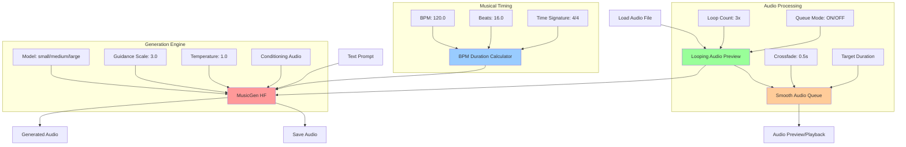

# ComfyUI MusicGen (Hugging Face)

A **standalone** ComfyUI custom node package for Facebook's MusicGen using Hugging Face Transformers. Generate high-quality music from text prompts with full support for CUDA, MPS (Apple Silicon), and CPU.

## ✨ Features

- 🎵 **Text-to-Music Generation** - Create music from natural language descriptions
- 🎛️ **Multiple Model Sizes** - Choose between small, medium, and large models
- 🍎 **Apple Silicon Support** - Full MPS acceleration for M1/M2/M3 Macs
- 🚀 **Multi-Device Support** - Automatic device detection (CUDA/MPS/CPU)
- 🎚️ **Advanced Controls** - Guidance scale, sampling, temperature controls
- 🎼 **Musical Timing Control** - BPM-based duration with beat precision
- 🔄 **Audio Preview & Looping** - Preview with looping and queue management
- 🎧 **Smooth Audio Transitions** - Crossfading and seamless audio playback
- 📁 **Multi-Format Export** - Save as WAV, FLAC, MP3, or Opus with quality settings
- 🔧 **Standalone Operation** - No dependencies on ComfyUI core modifications
- 🎧 **Built-in Audio Utilities** - Complete audio loading and saving capabilities

## 🚀 Installation

### Option 1: Clone from GitHub
```bash
cd /path/to/ComfyUI/custom_nodes/
git clone https://github.com/your-username/ComfyUI-MusicGen-HF.git
cd ComfyUI-MusicGen-HF
pip install -r requirements.txt
```

### Option 2: Manual Installation
1. **Navigate to your ComfyUI custom nodes directory:**
   ```bash
   cd /path/to/ComfyUI/custom_nodes/
   ```

2. **Create the directory:**
   ```bash
   mkdir ComfyUI-MusicGen-HF
   cd ComfyUI-MusicGen-HF
   ```

3. **Install dependencies:**
   ```bash
   pip install transformers>=4.30.0 accelerate>=0.20.0 scipy>=1.10.0 torch>=2.0.0 torchaudio>=2.0.0 av>=15.0.0
   ```

4. **Add the node files** (copy `nodes.py`, `__init__.py`, and `requirements.txt`)

5. **Restart ComfyUI**

> **Note**: This is a completely standalone package - no modifications to ComfyUI core files are required!

## 🎵 Usage

### Available Nodes

#### Core Generation
- **MusicGen (Hugging Face)** - Main text-to-music generation node with conditioning support
- **BPM Duration Calculator** - Musical timing control with BPM and beat precision

#### Audio Processing & Preview
- **Looping Audio Preview** - Preview audio with looping and queue management
- **Smooth Audio Queue** - Crossfading and seamless audio transitions with precise timing
- **Professional Loop Transition** - Advanced loop transitions with beat-matching and professional audio processing

#### Audio I/O
- **Save Audio (WAV/FLAC/MP3/Opus)** - Advanced audio saver with format options
- **Load Audio File** - Load audio files for conditioning or processing
- **Save MusicGen Audio (Legacy)** - Simplified audio saver for basic use

## 🔄 Node System Overview



### Workflow Patterns

#### 1. Basic Text-to-Music
```
Text Prompt → MusicGen → Save Audio
```

#### 2. Musical Timing Control
```
BPM Calculator → MusicGen → Save Audio
     ↑
(120 BPM, 16 beats, 4/4 time)
```

#### 3. Audio Conditioning with Preview
```
Load Audio → Looping Preview → MusicGen → Save Audio
                    ↓
            conditioning_audio
```

#### 4. Smooth Playback System
```
Generated Audio → Smooth Audio Queue → Preview/Playback
                       ↑
            (Crossfade, Precise Timing)
```

### Audio Conditioning (Optional)

1. **Load Reference Audio:**
   - Add `Load Audio File` node
   - Specify path to reference audio file
   - Connect to MusicGen's `conditioning_audio` input

2. **Generate Continuation:**
   - The model will generate music that continues/extends the reference audio

### Model Sizes

- **Small** (~1.5GB): Fast generation, good quality
- **Medium** (~3.3GB): Better quality, slower generation  
- **Large** (~3.3GB): Best quality, slowest generation

### Device Support

The node automatically detects and uses the best available device:

- **CUDA** (NVIDIA GPUs): Full acceleration with mixed precision
- **MPS** (Apple Silicon): Optimized for M1/M2/M3 chips
- **CPU**: Fallback for compatibility

### Audio Format Options

| Format | Quality Settings | Best For |
|--------|------------------|----------|
| **WAV** | Uncompressed | Highest quality, large files |
| **FLAC** | Lossless | High quality, smaller than WAV |
| **MP3** | 128k, 192k, 320k, V0 | Good compression, wide compatibility |
| **Opus** | 64k, 96k, 128k, 192k, 320k | Best compression, modern standard |

## 📚 Node Documentation

### MusicGen (Hugging Face)
Main audio generation engine with enhanced conditioning support.

**Parameters:**
- **prompt**: Text description of the music to generate
- **model_size**: small/medium/large model variants
- **duration**: Length of generated audio (1-30 seconds)
- **guidance_scale**: Higher values follow prompt more closely (1-10)
- **do_sample**: Enable sampling for more diverse outputs
- **max_new_tokens**: Maximum tokens to generate (50-1503)
- **seed**: Random seed for reproducible generation
- **temperature**: Sampling randomness (0.1-2.0)
- **conditioning_audio**: Optional reference audio for continuation
- **duration_override**: Duration input from BPM Calculator (0 = use manual duration)

### BPM Duration Calculator
Converts musical timing (BPM + beats) to precise duration for MusicGen.

**Parameters:**
- **bpm**: Beats per minute (60.0-200.0, step: 0.1)
- **beats**: Number of beats to generate (1.0-64.0, step: 0.25)
- **time_signature**: Musical time signature (4/4, 3/4, 6/8, 2/4)

**Outputs:**
- **duration**: Calculated duration in seconds
- **info**: Musical timing information and token calculations

**Usage Example:**
- 120 BPM × 16 beats = 8.0 seconds
- Automatically caps duration to respect 1503 token limit
- Provides precise musical timing for consistent generation

### Looping Audio Preview
Enhanced audio preview with looping and intelligent queue management.

**Parameters:**
- **audio**: Input audio to preview
- **loop_count**: Number of preview loops (1-10)
- **enable_preview**: Toggle preview playback
- **queue_mode**: Wait for current audio to finish before playing new audio
- **instance_id**: Unique identifier for multiple preview nodes

**Outputs:**
- **looped_preview**: Audio repeated for extended preview
- **conditioning_audio**: Pass-through for MusicGen conditioning
- **info**: Queue status, timing, and preview information

### Smooth Audio Queue
Advanced audio processing with crossfading and precise timing control.

**Parameters:**
- **audio**: Input audio to process
- **target_duration**: Precise duration target (0 = use original, step: 0.01)
- **crossfade_duration**: Smooth transition time between clips (0-2.0s)
- **queue_id**: Identifier for multiple audio streams
- **auto_play**: Automatically handle transitions when audio changes

**Outputs:**
- **queued_audio**: Processed audio with smooth transitions
- **conditioning_audio**: Original audio for MusicGen
- **info**: Processing status, timing, and queue information

**Features:**
- **Duration Validation**: Rounds to token boundaries (~0.02s) for optimal generation
- **Post-processing**: Trims or pads audio to exact target duration
- **Crossfading**: Creates smooth transitions between audio clips
- **Queue Management**: Handles multiple audio clips with seamless playback

### Professional Loop Transition
Professional-grade loop transitions designed for dance music workflows.

**Parameters:**
- **audio**: Input audio to process
- **bpm**: BPM for beat-aligned transitions (60.0-200.0)
- **transition_type**: Algorithm for creating transitions
  - `beat_match`: Standard beat-aligned crossfade (best for rhythmic music)
  - `phrase_match`: Same as beat_match but for phrase boundaries
  - `zero_cross`: Finds optimal zero-crossing points (cleanest cuts)
  - `power_match`: Matches power levels before crossfading (best for volume consistency)
- **transition_beats**: Duration of transition in beats (0.25-8.0)
- **loop_id**: Identifier for multiple audio streams
- **auto_normalize**: Automatically balance audio levels
- **dc_offset_removal**: Remove DC bias for cleaner audio
- **crossfade_curve**: Shape of transition curve (linear/equal_power/exponential/s_curve)
- **phase_align**: Align audio phases for smoother transitions

**Outputs:**
- **looped_audio**: Audio with professional transition applied
- **conditioning_audio**: Original audio for MusicGen conditioning
- **info**: Processing status and transition details

**Advanced Features:**
- **DC Offset Removal**: Removes unwanted DC bias that can cause pops/clicks
- **Phase Alignment**: Analyzes waveforms and aligns phases to reduce phase cancellation
- **Zero-Crossing Detection**: Finds natural break points in audio waveforms
- **Power Matching**: Balances volume levels for consistent transitions
- **Beat-Aware Processing**: Creates transitions aligned to musical beats

## 🎼 Advanced Workflow Examples

### 1. Musical Loop Creation
```
BPM Calculator (120 BPM, 8 beats, 4/4) → MusicGen → Looping Preview (3x loops)
                                                      ↓
                                                Smooth Queue → Final Audio
```
Perfect for creating seamless musical loops with precise timing.

### 2. Audio Continuation Chain
```
Load Audio → Looping Preview → MusicGen → Smooth Queue → MusicGen (next) → Save
     ↓           ↓                ↓            ↓
conditioning  preview      generation_1   transition   generation_2
```
Create extended compositions by chaining generations with smooth transitions.

### 3. Multi-Track Preview System
```
Track 1: Load Audio → Looping Preview (instance: "track1") → Preview 1
Track 2: Generated → Looping Preview (instance: "track2") → Preview 2
Track 3: BPM Calc → MusicGen → Looping Preview (instance: "track3") → Preview 3
```
Preview multiple audio sources simultaneously with independent queue management.

### 4. Precise Duration Matching
```
Target Duration: 7.583s
                ↓
Audio Source → Smooth Queue (target_duration: 7.583) → Exact 7.583s Output
```
Create audio clips with sample-accurate duration for synchronization.

### 5. Crossfade DJ-Style Mixing
```
Track A → Smooth Queue (crossfade: 2.0s, queue_id: "mix") → Mixed Output
Track B → Smooth Queue (crossfade: 2.0s, queue_id: "mix") → Mixed Output
```
Create smooth DJ-style transitions between different audio sources.

### 6. Professional Dance Music Loops
```
Generated Audio → Professional Loop Transition (128 BPM, beat_match, 1.0 beats) → Seamless Loop
```
Create professional-quality loops with beat-aligned transitions.

## 🎧 Professional Loop Transition Usage Guide

### Best Practices by Genre

#### **House/Techno Music (128 BPM)**
```
bpm: 128.0
transition_type: "beat_match"
transition_beats: 1.0
crossfade_curve: "equal_power"
phase_align: True
```

#### **Breakbeat/DnB (174 BPM)**
```
bpm: 174.0
transition_type: "power_match"
transition_beats: 0.5
crossfade_curve: "s_curve"
phase_align: True
```

#### **Ambient/Downtempo**
```
transition_type: "zero_cross"
transition_beats: 2.0-4.0
crossfade_curve: "exponential"
auto_normalize: True
```

### Transition Types Explained

1. **beat_match**: Standard DJ-style beat matching - best for rhythmic music
2. **zero_cross**: Finds natural break points in the audio waveform - cleanest for any genre
3. **power_match**: Balances volume levels first - best when audio levels vary significantly
4. **phrase_match**: Same as beat_match but intended for phrase boundaries (4, 8, 16 beats)

### Common Connection Patterns

1. **Basic Loop**: `HuggingFaceMusicGen` → `ProfessionalLoopTransition` → `SaveAudioStandalone`
2. **With Preview**: `HuggingFaceMusicGen` → `ProfessionalLoopTransition` → `LoopingAudioPreview`
3. **Conditioning Chain**: `ProfessionalLoopTransition` → `AudioOutputToConditioningQueue` → `HuggingFaceMusicGen`

### Troubleshooting Professional Transitions

- **Choppy transitions**: Increase `transition_beats` or try `zero_cross` mode
- **Volume jumps**: Enable `power_match` and `auto_normalize`
- **Phase issues**: Enable `phase_align` and use `equal_power` curve
- **Artifacts**: Enable `dc_offset_removal` and try `s_curve` crossfading

## Example Prompts

### Musical Styles
- "80s pop track with bassy drums and synth"
- "classical piano piece in minor key" 
- "upbeat jazz with saxophone solo"
- "ambient electronic soundscape"
- "acoustic guitar fingerpicking folk song"

### Genre-Specific with BPM
- "house music at 128 BPM with four-on-the-floor kick"
- "slow blues at 70 BPM with guitar and harmonica"
- "drum and bass at 174 BPM with heavy sub bass"
- "waltz at 180 BPM in 3/4 time signature"

### Mood and Atmosphere
- "melancholic indie folk with reverb-heavy vocals"
- "energetic punk rock with distorted guitars"
- "peaceful nature sounds with gentle piano"
- "epic orchestral soundtrack with brass section"

## Troubleshooting

### MPS Issues
If you encounter MPS errors:
- The node will automatically fallback to CPU
- Ensure macOS 12.3+ and PyTorch 2.0+

### Memory Issues
- Start with "small" model
- Reduce `max_new_tokens` 
- Lower `duration`
- Disable preview loops if memory constrained

### Model Download
- First run downloads models to `~/.cache/huggingface/`
- Ensure stable internet connection
- Models are cached for subsequent use

### Node-Specific Issues

#### BPM Duration Calculator
- **Duration too long**: Automatically capped at token limit (30.06s max)
- **Precision issues**: Durations rounded to ~0.02s token boundaries
- **Time signature**: Only affects measure calculations, not duration

#### Looping Audio Preview
- **Queue not working**: Check `instance_id` is unique for multiple nodes
- **Audio not looping**: Verify `loop_count > 1` and `enable_preview = True`
- **Memory usage**: High loop counts create large audio tensors

#### Smooth Audio Queue
- **Crossfade artifacts**: Reduce `crossfade_duration` for short audio clips
- **Timing drift**: Use `target_duration` for precise synchronization
- **Queue conflicts**: Use different `queue_id` for independent streams

#### Professional Loop Transition
- **Choppy transitions**: Increase `transition_beats` or try `zero_cross` mode
- **Volume jumps**: Enable `power_match` and `auto_normalize`
- **Phase issues**: Enable `phase_align` and use `equal_power` curve
- **Artifacts**: Enable `dc_offset_removal` and try `s_curve` crossfading
- **BPM mismatch**: Ensure BPM parameter matches your audio's actual tempo
- **Loop state issues**: Use different `loop_id` for independent transition chains

## 📋 Requirements

### System Requirements
- **Python**: 3.8+
- **RAM**: 8GB+ recommended (4GB minimum, 12GB+ for smooth queue processing)
- **Storage**: 2-4GB for model cache + additional space for audio processing
- **GPU**: Optional but recommended (CUDA/MPS support)
- **Audio**: System audio output for preview functionality

### Dependencies
All dependencies are automatically installed via `requirements.txt`:
- `torch>=2.0.0` - Deep learning framework
- `torchaudio>=2.0.0` - Audio processing
- `transformers>=4.30.0` - Hugging Face models
- `accelerate>=0.20.0` - Model optimization
- `scipy>=1.10.0` - Scientific computing
- `av>=15.0.0` - Audio/video processing

### Compatibility
- ✅ **Windows** (CUDA/CPU)
- ✅ **macOS** (MPS/CPU) - Intel and Apple Silicon
- ✅ **Linux** (CUDA/CPU)
- ✅ **ComfyUI** - All recent versions

## 🆕 Version History

### v1.1.0 (Latest)
- ✅ **BPM Duration Calculator** - Musical timing with beat precision
- ✅ **Looping Audio Preview** - Enhanced preview with queue management  
- ✅ **Smooth Audio Queue** - Crossfading and precise timing control
- ✅ **Enhanced MusicGen** - Duration override and improved conditioning
- ✅ **Advanced Workflows** - Multi-node audio processing pipelines

### v1.0.0
- ✅ Basic MusicGen text-to-audio generation
- ✅ Multi-format audio export (WAV/FLAC/MP3/Opus)
- ✅ Device optimization (CUDA/MPS/CPU)
- ✅ Audio loading and conditioning support

## 🔗 Links

- [MusicGen Paper](https://arxiv.org/abs/2306.05284)
- [Hugging Face Model Hub](https://huggingface.co/facebook/musicgen-small)
- [ComfyUI](https://github.com/comfyanonymous/ComfyUI)
- [Mermaid Flowchart Documentation](https://mermaid.js.org/)

---

## 🎯 Quick Start Guide

1. **Install**: Clone repo + `pip install -r requirements.txt`
2. **Basic**: Text → MusicGen → Save Audio  
3. **Musical**: BPM Calculator → MusicGen → Save Audio
4. **Preview**: Audio → Looping Preview → MusicGen
5. **Advanced**: Audio → Smooth Queue → Crossfaded Output

**Ready to create music? Start with the Basic workflow and explore the advanced features!** 🎵

---
